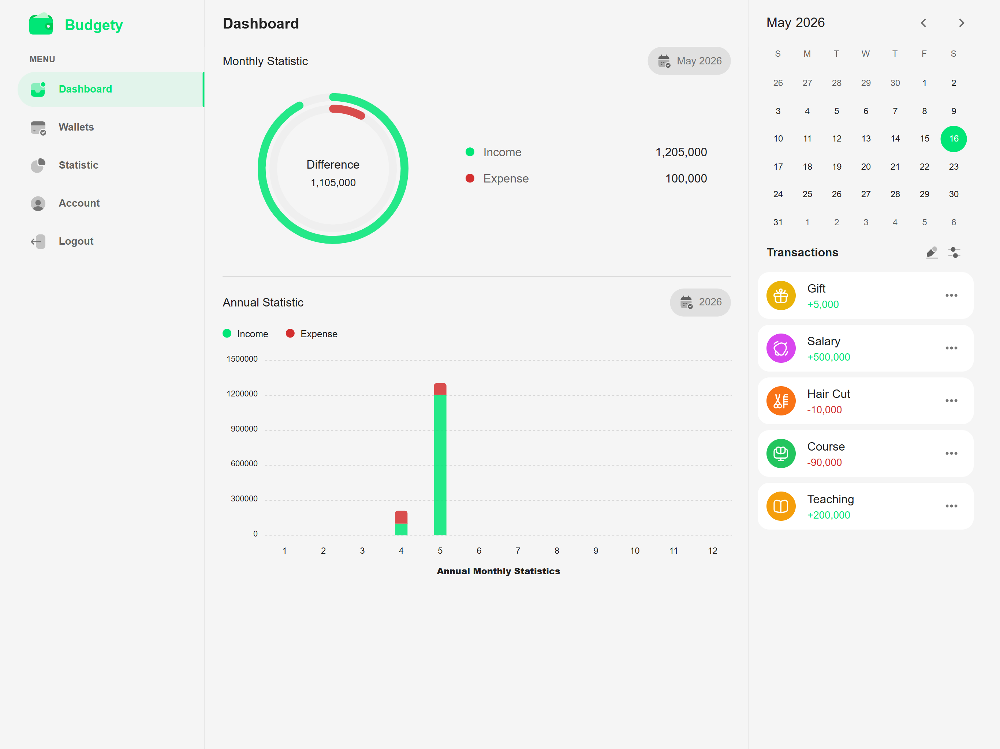
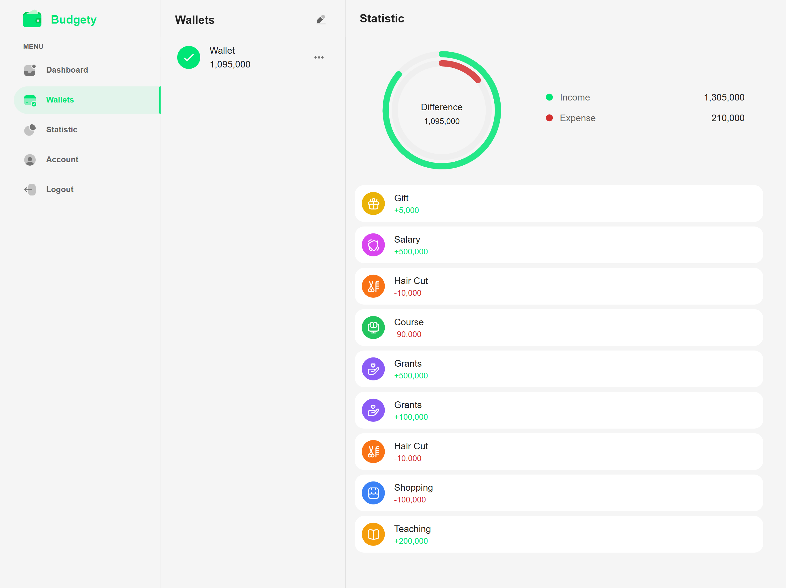
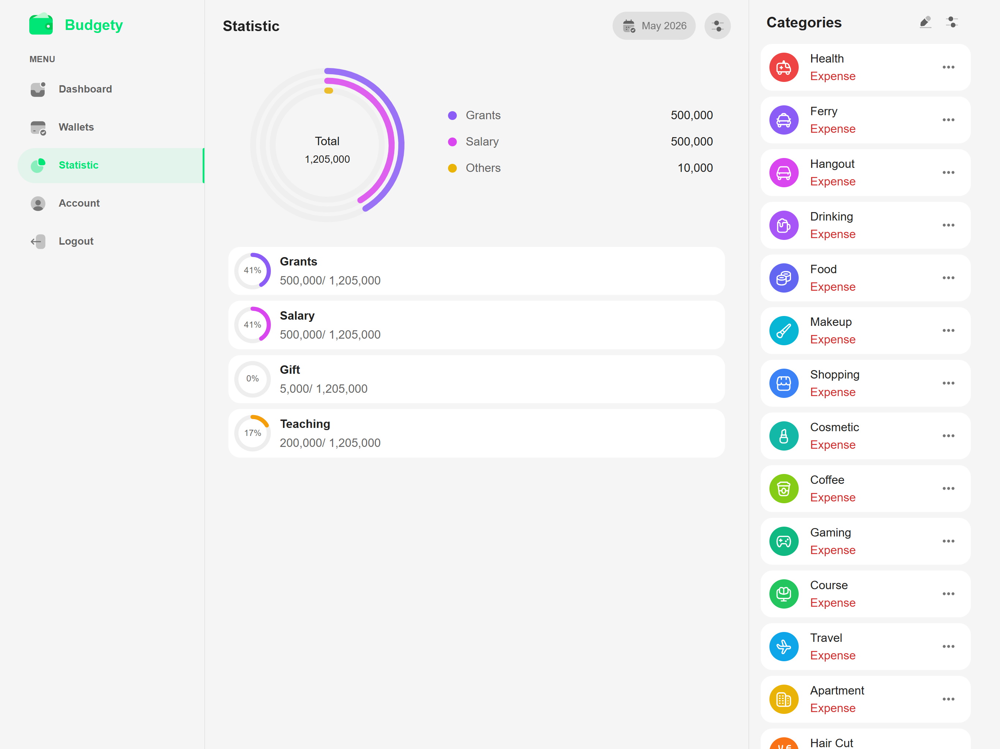
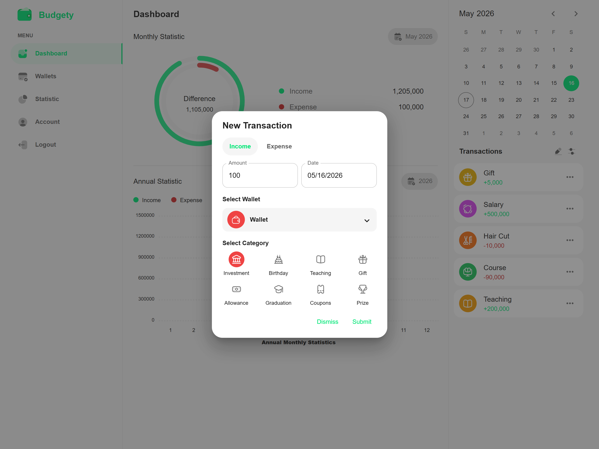
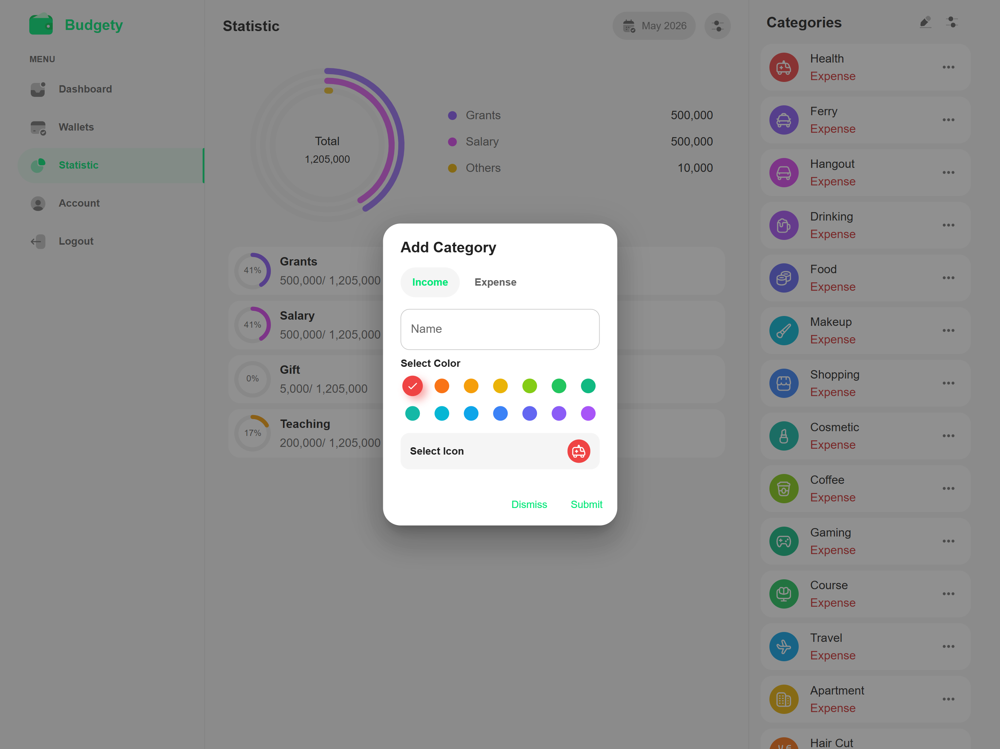

# Budgety: Personal Finance Tracker

A full-stack personal budget tracking web application with multi-wallet support, income/expense analytics, category breakdowns, and OTP-based email authentication. Built with React and Material UI, with a fully responsive layout that switches between a sidebar-driven desktop view and a bottom-navigation mobile view.

> **Backend:** [budgety-adventure-api](https://github.com/MrPhyaeSoneThwim/budgety-adventure-api) (Node.js · Express · MongoDB Atlas)

---

## Screenshots

<p align="center">
  
  <br/>
  <em>Dashboard: monthly radial chart, annual bar chart, date-navigable calendar, and live transaction feed</em>
</p>

<br/>

<p align="center">
  
  <br/>
  <em>Wallets: per-wallet donut chart with income/expense breakdown and full transaction history</em>
</p>

<br/>

<p align="center">
  
  <br/>
  <em>Statistic: multi-segment donut chart with percentage contribution per category, powered by MongoDB aggregation</em>
</p>

<br/>

<table width="100%">
  <tr>
    <td width="50%"></td>
    <td width="50%"></td>
  </tr>
  <tr>
    <td align="center"><em>New Transaction: type, amount, date, wallet, and category</em></td>
    <td align="center"><em>Add Category: name, colour palette, and icon picker</em></td>
  </tr>
</table>

---

## Features

- **OTP Email Verification**: signup triggers a 5-digit OTP; the account activates only after successful verification
- **JWT Authentication**: token decoded on mount with automatic expiry handling; auto-logout on token invalidation
- **Multi-wallet Management**: create wallets with custom icons and colours; cascade-delete removes all linked transactions
- **Transaction Tracking**: income and expense entries per wallet, filterable by date
- **Dashboard Analytics**: monthly radial bar chart with income/expense rates and net difference; annual bar chart by month
- **Category Statistics**: donut chart with percentage contribution per category for a selected month
- **Per-wallet Stats**: balance, income/expense totals, and full transaction history for a single wallet
- **Account Settings**: update profile and avatar, change password, toggle dark/light theme, switch language (English / Myanmar)
- **Responsive Design**: purpose-built component trees for desktop (sidebar layout) and mobile (bottom navigation), with automatic routing between them at the MUI `md` breakpoint

---

## Tech Stack

| Layer | Technology |
|---|---|
| UI Framework | React 17 |
| Component Library | Material UI v5 |
| State Management | Redux + redux-thunk |
| Routing | React Router v6 |
| Forms & Validation | Formik + Yup |
| Charts | ApexCharts (react-apexcharts) |
| HTTP Client | Axios |
| Internationalisation | i18next + react-i18next |
| Date Handling | date-fns + MUI DatePicker |

---

## Architecture

### Responsive dual-tree routing

Desktop and mobile views live in completely separate directories (`src/desktop/` and `src/mobile/`). The router detects the viewport at the MUI `md` breakpoint and redirects between them, keeping each layout's concerns fully isolated:

```
/wallets        →  desktop: WalletList + WalletStats side panel
                →  mobile:  redirects to /mobile-wallets
```

### Redux store

Five combined slices with discrete `REQUEST → SUCCESS | FAIL` actions and explicit reset actions (`RESET_ERROR`, `RESET_SUCCESS`) for transient UI state:

| Slice | Covers |
|---|---|
| `userState` | auth token, user profile, OTP flow, password update |
| `transState` | transactions list, monthly stats, annual stats |
| `walletState` | wallets list, single wallet, per-wallet stats |
| `categoryState` | categories list, per-category monthly breakdown |
| `theme` | `themeMode` (light / dark), `lang` (en / mm) |

### API layer

A single Axios instance (`src/http/index.jsx`) is shared across all action files. Authenticated requests pass the JWT from Redux state via `getAuthConfig(token)`; the token is read from `localStorage` only once, at store initialisation.

---

## Getting Started

### Prerequisites

- Node.js 18 LTS
- The [backend API](https://github.com/MrPhyaeSoneThwim/budgety-adventure-api) running on `http://localhost:5000`

### Installation

```bash
git clone https://github.com/MrPhyaeSoneThwim/budgety-adventure-frontend.git
cd budgety-adventure-frontend
npm install --legacy-peer-deps
npm start
```

`--legacy-peer-deps` is required because `react-otp-input@2.4.0` declares a peer dependency on React 16, but the project runs on React 17. The `start` script includes `NODE_OPTIONS=--openssl-legacy-provider` to resolve the webpack 4 / OpenSSL 3 incompatibility on Node 18+.

---

## Project Structure

```
src/
├── desktop/          # Desktop views (sidebar layout)
│   ├── auth/         # Login, Signup, OTP verification
│   ├── dashboard/    # Monthly & annual charts + transaction list
│   ├── wallets/      # Wallet list + per-wallet stats panel
│   ├── statistic/    # Category donut chart + category list
│   └── account/      # Profile update + theme/language settings
├── mobile/           # Mobile views (bottom nav layout)
├── store/            # Redux: actions, reducers, constants
├── common/           # Layout components (AppBar, SideBar, BottomNav)
├── shared/           # Reusable UI (ColorPicker, AvatarPicker, NumberFormat…)
├── chart/            # ApexCharts config and global chart styles
├── http/             # Axios instance + auth header helper
└── i18n/             # Locale files (en.json, mm.json)
```
